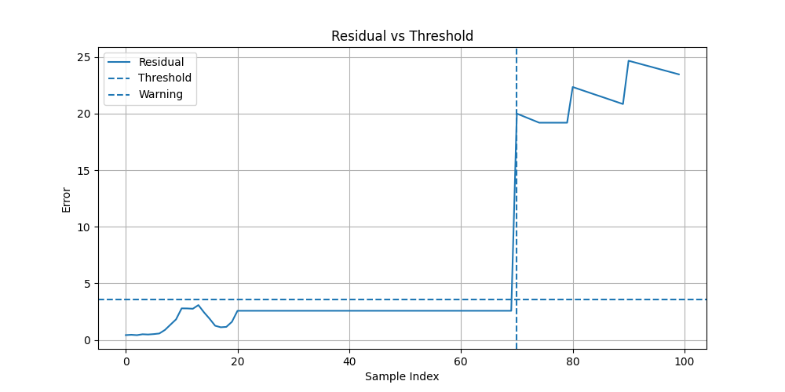
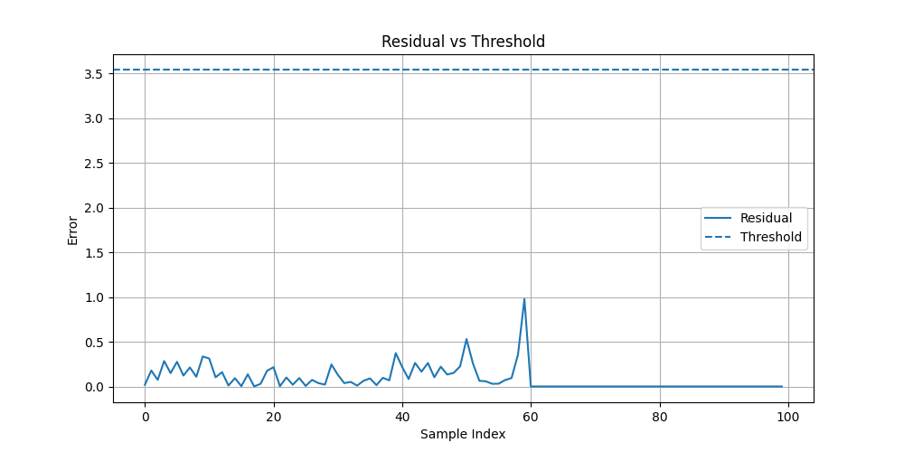
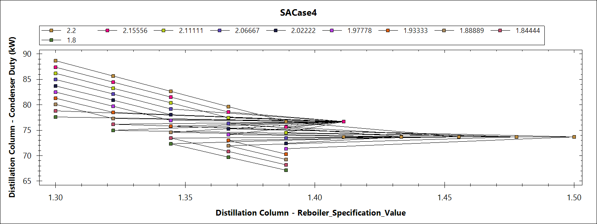
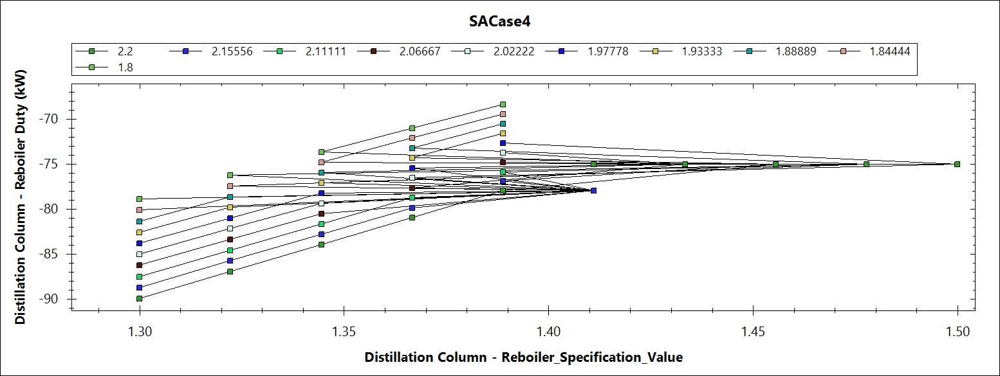
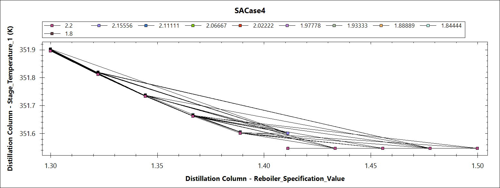
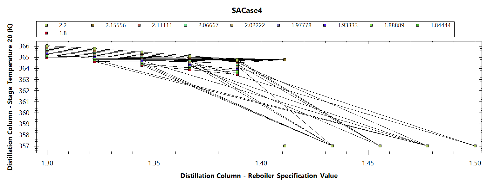
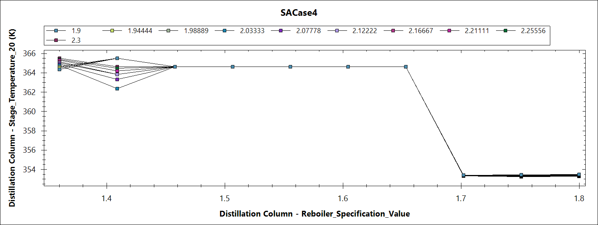
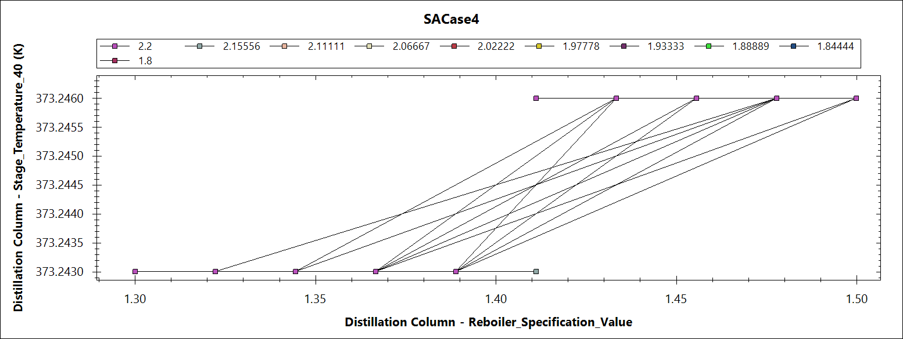
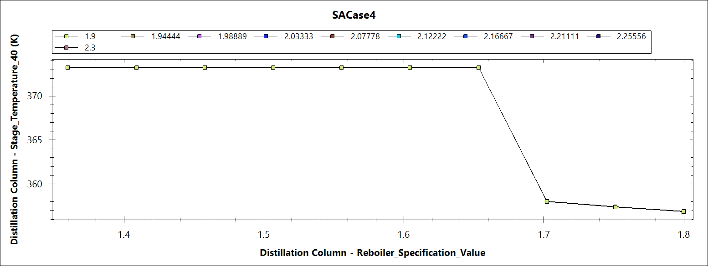

# 🏭 Predictive Maintenance Framework for Ethanol Production Plant

<div align="center">


**Combining process simulation (DWSIM) with machine learning (Random Forest) to detect faults in a distillation column — before they cause a shutdown.**

*B.Tech Semester 6 Project · Department of Chemical Engineering · SVNIT Surat*

</div>

---

## 📌 Problem Statement

In ethanol production plants, the **distillation column** is the most critical and energy-intensive unit. It separates ethanol from a fermentation broth (8–12% ethanol) using vapor-liquid equilibrium principles.

Traditional maintenance is either:
- **Reactive** — fix it after it breaks (expensive downtime)
- **Scheduled** — replace parts on a calendar (wasteful, ignores actual condition)

Neither approach catches **gradual degradation** early enough.

**This project builds a data-driven predictive maintenance framework** that learns normal column behavior and raises early warnings when process variables start deviating — before failure occurs.

---

## 🔬 Process Overview

The ethanol plant modelled in this project follows a standard fermentation-distillation route:

```
Glucose/Water Feed → Fermenter → Gas-Liquid Separator → Compound Separator → Distillation Column → Ethanol (top) + Water (bottom)
```

**Fermentation Reaction:**
```
C₆H₁₂O₆ → 2C₂H₅OH + 2CO₂
```

The distillation column (simulated in DWSIM) operates with:

| Parameter | Value |
|---|---|
| Number of Stages | 40 |
| Estimated Column Height | 21,000 mm |
| Estimated Column Diameter | 237.141 mm |
| Condenser Duty | 70.4632 kW |
| Reboiler Duty | -71.8074 kW |
| Column Pressure Drop | 400 Pa |
| Reboiler Specification Value (optimal) | ~1.4 |
| Condenser Specification Value | 2.0 |
| Residual Mass Balance Error | -2.04406 × 10⁻⁵ kg/s ✅ |

> The near-zero mass balance error confirms good simulation convergence in DWSIM.

---

## ⚙️ Predictive Maintenance Framework

### Core Idea

Train a machine learning model **only on healthy (normal) operating data**. When new data comes in, compare actual values vs. predicted values. If the deviation (residual) crosses a threshold → **anomaly detected**.

```
Healthy DWSIM Data → Train Random Forest → Learn Normal Behavior
                                                    ↓
New Operating Data → Predict Expected Output → Compare with Actual
                                                    ↓
                              Residual > Threshold → ⚠️ EARLY WARNING
```

### Features Used

| Type | Variable |
|---|---|
| **Input (X)** | Reboiler Specification, Condenser Specification |
| **Output (y)** | Condenser Duty, Reboiler Duty, T_top (Stage 1), T_mid (Stage 20), T_bottom (Stage 40) |

---

## 🤖 Machine Learning Model

**Algorithm:** Random Forest Regressor (multi-output regression)

```python
model = RandomForestRegressor(n_estimators=200, random_state=42)
model.fit(X_healthy, y_healthy)
```

**Why Random Forest?**
- Handles non-linear relationships between distillation variables
- Robust to noise in simulation data
- No assumptions about data distribution

**Threshold Calculation:**
```python
resid_h = np.abs(y_h - y_h_pred)
threshold = np.percentile(resid_h, 99) * 3.5
```

**Early Warning Logic:**
- A sliding window of 5 consecutive anomalies triggers an early warning
- Prevents false positives from isolated spikes

---

## 📊 Results

| Metric | Value |
|---|---|
| Anomaly Detection Threshold | **3.5387** |
| R² on Faulty Data | **-0.0889** (model correctly fails to fit fault patterns) |
| Early Warning Triggered At | **Index 70** |

> A negative R² on faulty data is expected and intentional — it confirms the model was trained on normal behavior only and correctly identifies faulty data as anomalous.

### Residual vs Threshold

<div align="center">

| Healthy Baseline | Fault Detection |
|:---:|:---:|
|  |  |

</div>

- Under **healthy conditions**, residuals stay low and within range
- Under **faulty conditions**, residuals spike sharply — crossing both warning and threshold limits
- Early warning triggered at **index 70**, well before complete system failure

---

### 📈 Condenser & Reboiler Duty Profiles

<div align="center">

| | Healthy Operation | Faulty Operation |
|---|:---:|:---:|
| **Condenser Duty** |  |  |
| **Reboiler Duty** |  |  |

</div>

---

### 🌡️ Stage Temperature Profiles

<div align="center">

| Stage | Healthy | Faulty |
|---|:---:|:---:|
| **Top (Stage 1)** |  |  |
| **Middle (Stage 20)** |  |  |
| **Bottom (Stage 40)** |  |  |

</div>

**Key Findings:**
- The **reboiler specification** is the most sensitive parameter — small deviations cause significant shifts in temperature distribution and condenser duty
- **Temperature profiles** (T_top, T_mid, T_bottom) clearly indicate vapor-liquid equilibrium disturbances
- Monitoring **multiple output variables together** is more reliable than watching any single parameter

---

## 📁 Repository Structure

```
distillation-predictive-maintenance-ethanol-plant/
│
├── Data/
│   ├── distillation_healthy.csv       # Normal operating data (DWSIM simulation)
│   ├── distillation_faulty.csv        # Off-design/disturbed operating data
│   └── distillation_results.csv       # Output: residuals + anomaly flags per sample
│
├── Healthy/                           # Plots under normal operating conditions
│   ├── Condenser-Duty.png
│   ├── Reboiler-Duty.png
│   ├── T1.png                         # Top stage temperature
│   ├── T20.png                        # Middle stage temperature
│   └── T40.png                        # Bottom stage temperature
│
├── Faulty/                            # Plots under disturbed/fault conditions
│   ├── Condenser-Duty.png
│   ├── Reboiler-Duty.png
│   ├── T1.png
│   ├── T20.png
│   └── T40.png
│
├── Output/                            # Anomaly detection results
│   ├── Figure_1.png                   # Residual vs Threshold (healthy baseline)
│   └── Figure_2.png                   # Residual vs Threshold (fault detection)
│
├── Alcohol.dwxmz                      # DWSIM simulation file
├── distillation_column_ml_model.py    # Main script — train, predict, detect anomalies
├── .gitignore
├── LICENSE
└── README.md
```

---

## 🚀 How to Run

**1. Clone the repo**
```bash
git clone https://github.com/uttkarshyadavv/distillation-predictive-maintenance-ethanol-plant.git
cd distillation-predictive-maintenance-ethanol-plant
```

**2. Install dependencies**
```bash
pip install numpy pandas scikit-learn matplotlib joblib
```

**3. Run the model**
```bash
python distillation_column_ml_model.py
```

**Expected terminal output:**
```
Threshold (from healthy): 3.5387
R2 on faulty data: -0.0889
⚠️ EARLY WARNING at index: 70
Results saved to distillation_results.csv
```

---

## 🛠️ Tech Stack

| Tool | Purpose |
|---|---|
| **DWSIM** | Open-source process simulation — generate healthy & faulty datasets |
| **Python** | Model development and analysis |
| **Scikit-learn** | Random Forest Regressor, R² scoring |
| **Pandas / NumPy** | Data loading, preprocessing, residual calculation |
| **Matplotlib** | Visualization of residuals, duty profiles, temperature trends |
| **Joblib** | Model serialization |

---

## 🧑‍🔬 Authors

**Utkarsh Yadav** · Chemical Engineering, SVNIT Surat  
[](https://linkedin.com/in/utkarsh-yadavv)
[](https://github.com/uttkarshyadavv)

**Charitra Patidar** · Chemical Engineering, SVNIT Surat

*Supervised by Dr. Parag P. Thakur, Assistant Professor, Dept. of Chemical Engineering, SVNIT Surat*

---

## 📄 License

This project is for academic purposes. Feel free to reference or build upon it with attribution.
